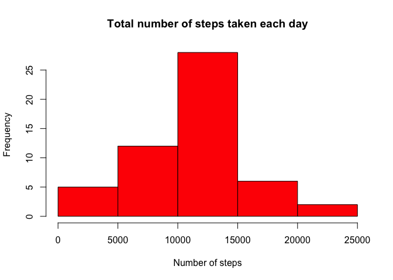
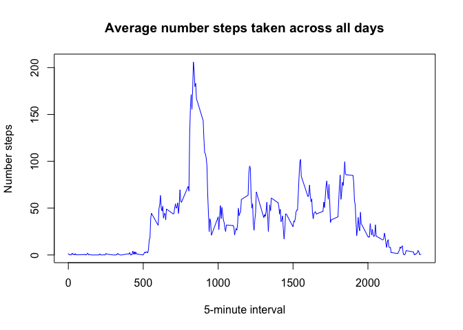
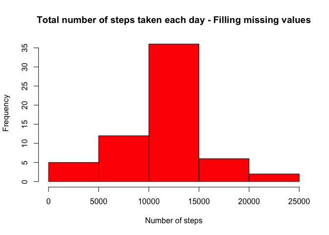
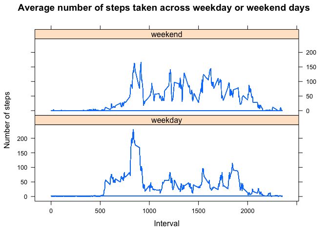

# Reproducible Research: Peer Assessment 1
by Susana Isabel Silva (May, 2015)

## Introduction

The goal of this assignment is to show the skills needed for reproducible research. For this assignment, I have to write a single R markdown document, that will be processed by knitr and transformed into an HTML file, that have the answers for the questions detailed in the sections below (Q1-Q5).


## Data

This assignment makes use of data from a personal activity monitoring device. This device collects data at 5 minute intervals through out the day. The data consists of two months of data from an anonymous individual collected during the months of October and November, 2012 and include the number of steps taken in 5 minute intervals each day. The data for this assignment can be downloaded from the course web site: [Activity monitoring data](https://d396qusza40orc.cloudfront.net/repdata%2Fdata%2Factivity.zip) [52K]. The variables included in this dataset are:

* steps: Number of steps taking in a 5-minute interval (missing values are coded as NA)
* date: The date on which the measurement was taken in YYYY-MM-DD format
* interval: Identifier for the 5-minute interval in which measurement was taken The dataset is stored in a comma-separated-value (CSV) file and there are a total of 17,568 observations in this dataset.


## Q1: Loading and preprocessing the data

1. Load the data: using read.csv command

```r
  activity <- read.csv(unz("activity.zip", "activity.csv"),header=TRUE)
  str(activity)
```

```
## 'data.frame':	17568 obs. of  3 variables:
##  $ steps   : int  NA NA NA NA NA NA NA NA NA NA ...
##  $ date    : Factor w/ 61 levels "2012-10-01","2012-10-02",..: 1 1 1 1 1 1 1 1 1 1 ...
##  $ interval: int  0 5 10 15 20 25 30 35 40 45 ...
```

2. Process/transform the data (if necessary) into a format suitable for your analysis: 
convert date variable to date data type

```r
  activity$date <- as.Date(activity$date, '%Y-%m-%d')
  str(activity)
```

```
## 'data.frame':	17568 obs. of  3 variables:
##  $ steps   : int  NA NA NA NA NA NA NA NA NA NA ...
##  $ date    : Date, format: "2012-10-01" "2012-10-01" ...
##  $ interval: int  0 5 10 15 20 25 30 35 40 45 ...
```


## Q2: What is mean total number of steps taken per day?

1. Calculate the total number of steps taken per day (ignoring the missing values in the dataset)

```r
  ## Data subset for exclude missing values
  activity_woNA <- activity[!is.na(activity$steps),]
  totalsteps <- with(activity_woNA,tapply(steps,date,sum))  
```

2. Make a histogram of the total number of steps taken each day

```r
  ## Histogram using base plotting system
  hist(totalsteps, main="Total number of steps taken each day"
       , xlab="Number of steps", col="red")  
```

 

3. Calculate and report the mean and median of the total number of steps taken per day

```r
  ## Mean of the total number of steps taken per day
  mean(totalsteps)
```

```
## [1] 10766.19
```

```r
  ## Median of the total number of steps taken per day
  median(totalsteps)
```

```
## [1] 10765
```


## Q3: What is the average daily activity pattern?

1. Make a time series plot (i.e. type = "l") of the 5-minute interval (x-axis) and the average number of steps taken, averaged across all days (y-axis)

```r
  ## Average number of steps taken per 5-minute interval
  avgsteps <- with(activity_woNA,tapply(steps,interval,mean))
  ## Create data frame to represent times series plot
  activity_internalmean <- data.frame(interval=as.integer(names(avgsteps)),avgsteps)
  ## Graphic using base plotting system
  with(activity_internalmean, plot(interval,avgsteps, type="l", col="blue",
                                   xlab="5-minute interval", ylab="Number steps",
                                   main="Average number steps taken across all days"))
```

 

2. Which 5-minute interval, on average across all the days in the dataset, contains the maximum number of steps?

```r
  activity_internalmean[which.max(activity_internalmean$avgsteps), ]
```

```
##     interval avgsteps
## 835      835 206.1698
```

## Q4: Imputing missing values

1. Calculate the total number of missing values in the dataset

```r
  ## Data subset with only the missing values
  activity_NA <- activity[is.na(activity$steps),]
  ## Rows number
  nrow(activity_NA)
```

```
## [1] 2304
```

2. Strategy for filling all missing values in the dataset: using mean for that 5-minute interval

```r
  ## Merging activity_NA and activity_internalmean subsets using internalmean
  activity_auxiliar <- merge(activity_NA,activity_internalmean)
  ## Resorting activity_auxiliar by date and interval variables
  activity_auxiliar <- activity_auxiliar[order(activity_auxiliar$date,activity_auxiliar$interval),]
  ## Replacing missing values - considering floor function (steps are a integer variable)
  activity_auxiliar$steps <- floor(activity_auxiliar$avgsteps)
```

3. Create a new dataset that is equal to the original dataset but with the missing data filled in

```r
  ## New data set
  new_activity <- activity
  ## Replacing missing values on new data set
  new_activity[is.na(new_activity$steps),1] <- floor(activity_auxiliar$steps)
```

4. Make a histogram of the total number of steps taken each day and calculate and report the mean and median total number of steps taken per day. 
* New histogram

```r
  ## Total number steps for new_activity dada set
  newtotalsteps <- with(new_activity,tapply(steps,date,sum))
  ## Histogram using base plotting system
  hist(newtotalsteps, main="Total number of steps taken each day - Filling missing values"
       , xlab="Number of steps", col="red")  
```

 

* New mean and median

```r
  ## Mean of the total number of steps taken per day
  mean(newtotalsteps)
```

```
## [1] 10749.77
```

```r
  ## Median of the total number of steps taken per day
  median(newtotalsteps)
```

```
## [1] 10641
```

* Do these values differ from the estimates from the first part of the assignment? The values are different, because I had filled the missing values using mean for that 5-minute interval. The most difference is in median calculation.

* What is the impact of imputing missing data on the estimates of the total daily number of steps? Analising the previous histogram, is possible to see that it maintain the shape of the first histogram ploted, the unique difference consists on the obvious increase of the frequency for each number of steps.


## Q5: Are there differences in activity patterns between weekdays and weekends?

1. Create a new factor variable in the dataset with two levels ??? weekday and weekend: using filled-in missing values dataset

```r
  ## Convert new_activity in a data.table to create new variables for weekdays
  library(data.table)
  new_activity <- data.table(new_activity)
  ## Create new variable with the name of the week day
  new_activity[,weekday:=weekdays(new_activity$date)]
```

```
##        steps       date interval weekday
##     1:     1 2012-10-01        0  Monday
##     2:     0 2012-10-01        5  Monday
##     3:     0 2012-10-01       10  Monday
##     4:     0 2012-10-01       15  Monday
##     5:     0 2012-10-01       20  Monday
##    ---                                  
## 17564:     4 2012-11-30     2335  Friday
## 17565:     3 2012-11-30     2340  Friday
## 17566:     0 2012-11-30     2345  Friday
## 17567:     0 2012-11-30     2350  Friday
## 17568:     1 2012-11-30     2355  Friday
```

```r
  ## Replace the name of week day for the labels weekday and weekend
  new_activity[new_activity$weekday=="Saturday" | new_activity$weekday=="Sunday",4] <- "weekend"
  new_activity[new_activity$weekday!="weekend",4] <- "weekday"
  ## Convert weekday variable into a factor variable
  new_activity$weekday <- as.factor(new_activity$weekday)
```

2. Make a panel plot containing a time series plot (i.e. `type = "l"`) of the 5-minute interval (x-axis) and the average number of steps taken, averaged across all weekday days or weekend days (y-axis): using lattice plotting system (to look like the exemple given).

```r
  ## Create a new variable with the average steps for each 5-minute interval and weekday variable
  new_activity[,avgsteps:=mean(steps),by=.(interval,weekday)]
```

```
##        steps       date interval weekday   avgsteps
##     1:     1 2012-10-01        0 weekday 2.15555556
##     2:     0 2012-10-01        5 weekday 0.40000000
##     3:     0 2012-10-01       10 weekday 0.15555556
##     4:     0 2012-10-01       15 weekday 0.17777778
##     5:     0 2012-10-01       20 weekday 0.08888889
##    ---                                             
## 17564:     4 2012-11-30     2335 weekday 2.15555556
## 17565:     3 2012-11-30     2340 weekday 2.20000000
## 17566:     0 2012-11-30     2345 weekday 0.17777778
## 17567:     0 2012-11-30     2350 weekday 0.26666667
## 17568:     1 2012-11-30     2355 weekday 1.40000000
```

```r
  ## Plot
  library(lattice)
  p <- xyplot(avgsteps ~ interval | weekday, data=new_activity, 
              type = 'l', layout=c(1,2),
              main="Average number of steps taken across weekday or weekend days",
              xlab="Interval", ylab="Number of steps")
  print (p) 
```

 
